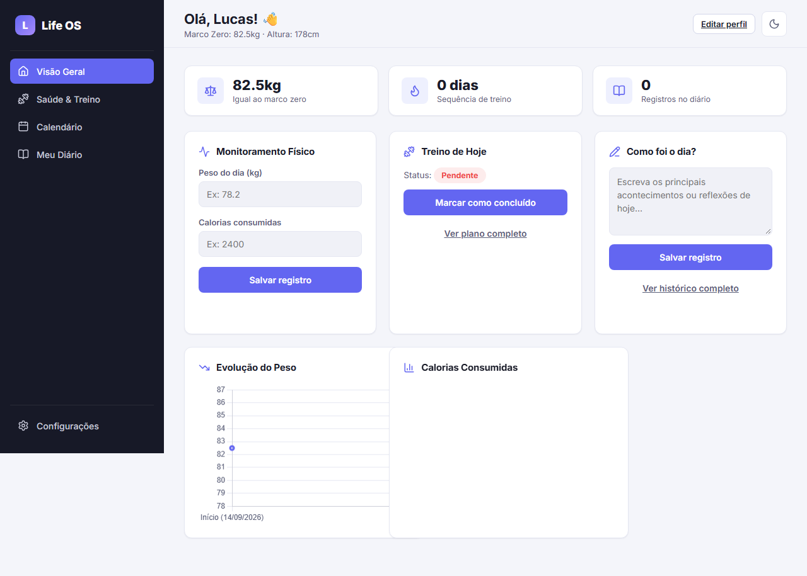
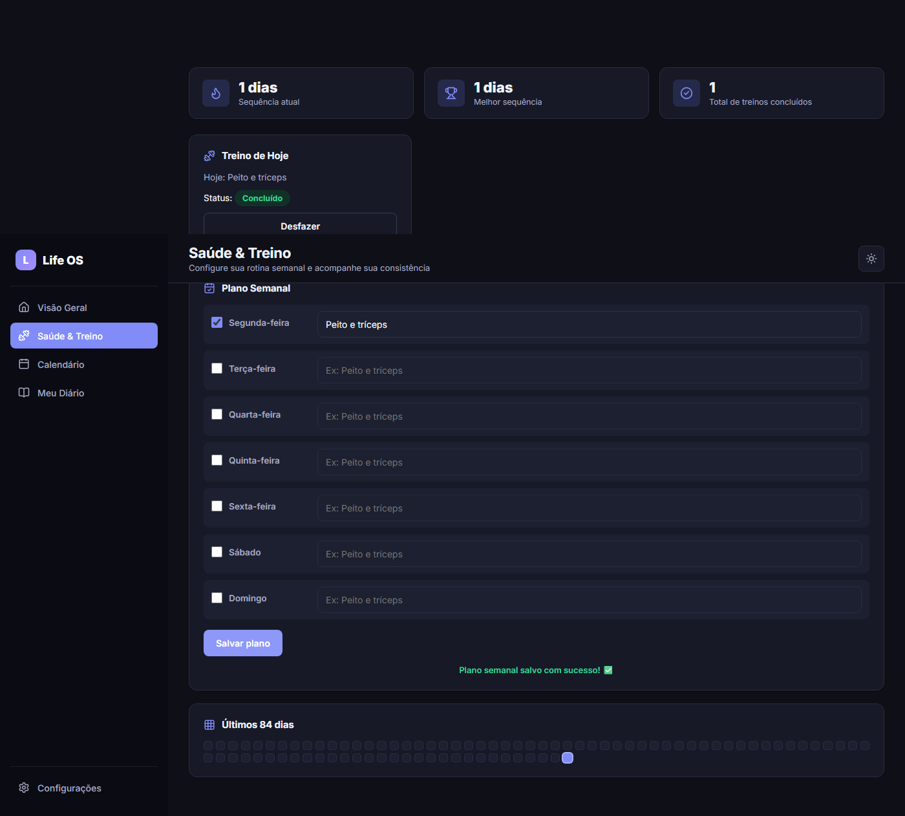

# Life OS

Painel pessoal para acompanhar saúde, treino, humor e reflexões diárias — tudo em um único lugar, direto no navegador, sem servidor ou banco de dados externo.




## ✨ Funcionalidades

- **Visão Geral** — resumo do dia com peso atual, sequência de treino, registros de diário e gráficos de evolução de peso e calorias.
- **Saúde & Treino** — plano de treino semanal configurável, sequência atual/recorde de dias treinados e um mapa de calor dos últimos 84 dias.
- **Calendário** — visão mensal com indicadores de diário, treino e peso registrados em cada dia; clique em um dia para ver os detalhes.
- **Meu Diário** — histórico completo das anotações diárias, com edição e exclusão de qualquer registro.
- **Configurações** — edição de perfil, escolha de tema (claro / escuro / sistema) e exportação/importação de backup dos dados em `.json`.
- **Modo claro e escuro** com detecção automática da preferência do sistema.
- **Responsivo** — menu lateral retrátil em telas de celular.

Todos os dados ficam salvos localmente no navegador (`localStorage`) — nenhuma informação é enviada para um servidor.

## 🛠️ Tecnologias

- HTML, CSS e JavaScript puros (sem frameworks, sem build step)
- [Chart.js](https://www.chartjs.org/) para os gráficos de evolução
- [Lucide Icons](https://lucide.dev/) para os ícones
- Fonte [Inter](https://fonts.google.com/specimen/Inter) via Google Fonts

## 🚀 Como rodar localmente

Por ser um site 100% estático, basta abrir o arquivo `index.html` diretamente no navegador, ou servir a pasta com qualquer servidor estático:

```bash
npx serve .
# ou
python -m http.server 8000
```

## 📁 Estrutura do projeto

```
├── index.html            # Visão Geral (dashboard)
├── treino.html           # Saúde & Treino
├── calendario.html       # Calendário
├── diario.html           # Histórico do Diário
├── configuracoes.html    # Perfil, aparência e dados
├── style.css             # Design system compartilhado (tokens, componentes, tema claro/escuro)
├── utils.js              # Funções compartilhadas (datas, storage, tema, export/import)
├── dashboard.js / treino.js / calendario.js / diario.js / config.js
```

## 📦 Backup dos dados

Como os dados vivem apenas no `localStorage` do navegador, use a página **Configurações → Seus dados** para exportar um backup em `.json` regularmente, ou para importar um backup existente ao trocar de navegador/dispositivo.
